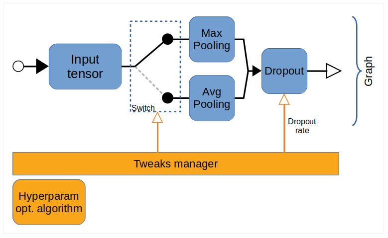

[](https://opensource.org/licenses/Apache-2.0)
[](https://www.python.org/)


# Hypergraph #

__Hypergraph__ is an open source library originally developed to provide a high level of abstraction when developing machine learning and deep neural networks.

The key concept of this library is the graph, a structure composed by interconnected nodes.
The connections between nodes play the crucial part, these can be optimized through meta-heurisitic optimisation algorithms (e.g. genetic algorithms).
The result is a network of nodes composed by "moving parts" which can be somehow altered by global optimization algorithms.
The "moving parts" of the structure are called tweaks. The optimization algorithms require a measure of
fitness, which is user-defined, to understand the effect of each tweak on the task to be optimized.

The purpose of the project is purely experimental and we are willing to get any contribution and comment. 

## Getting Started  with Hypergraph
##### Installation
To install Hypergraph the following command can be used. Hypergraph is 
compatible with Windows and Linux operating systems. It supports Python 3.6 or superior.

```bash
pip install git+https://github.com/aljabr0/hypergraph
```

#### Hypergraph and Keras in action

The core data structure of Hypergraph is a directed __graph__. Each graph consists of a number of 
__nodes__, the information in form of python objects, flows from the inputs, gets transformed and continues toward the single output that each node has.
Methods of creating nodes and adding them to a graph are demonstrated in the next sections. We start with a relatively
simple example where we use our framework to optimize the structure and some parameters of a neural network implemented
through [Keras](https://github.com/keras-team/keras).

##### Creating Nodes
Nodes are instances of the class *hg.Node*. However, there a number of shortcuts and tricks to define nodes using
standard python functions. Let's, for instance, declare a Keras model where some parameters and connections
between the layers are dynamic.
Here is a code snippet showing the declaration of the first node (note that node is meant in the hypegraph context, layer instead is used to distinguish Keras' parts):
```python
import hypergraph as hg
from keras.layers import Dense, Dropout, GlobalAveragePooling2D, GlobalMaxPooling2D

@hg.function()
# Declare the first tweak as a uniform choice between two types of global pooling
@hg.decl_tweaks(global_pool_op=hg.UniformChoice((GlobalAveragePooling2D, GlobalMaxPooling2D)))
# the second tweak is the dropout rate which will be a uniform value between 0 and 0.5
@hg.decl_tweaks(dropout_rate=hg.Uniform(0, 0.5))
def classifier_terminal_part(input_layer, class_count, global_pool_op, dropout_rate):
    """
    Create the terminal part of the model. This section is composed by a global pooling layer followed by a dropout
    and finally a dense layer. The type of global pooling is chosen automatically by the hyper-parameters optimization
    algorithm, the same also applies to the dropout rate.
    :param input_layer: The input layer which is the output of the node connected right on the top of this
    :param class_count:
    :param global_pool_op: The type of global pooling, this parameter is handled directly by hypergraph
    :param dropout_rate: The dropout rate, this parameter is handled directly by hypergraph
    :return: The output layer of this section of network
    """
    net = global_pool_op()(input_layer)
    net = Dropout(rate=dropout_rate)(net)
    return Dense(class_count, activation='softmax')(net)
```
First of all, to declare a functional node we define a function decorated with *@hg.function()*, this is just necessary
to install hypergraph's fine machinery around the function. 
The tweaks related to the current function are then declared using the decorator *@hg.decl_tweaks()* where the variable associated to the tweak is passed alongside its prior distribution.
The framework will then call the function with the parameters sampled according to the optimization strategy. The input parameters that are not declared as tweaks are instead retrieved by Hypergraph
from the inputs to the node.



__Figure 1__ The node created by *classifier_terminal_part* with its internal tweaks and their interaction with the various parts.

Similarly we define all the other nodes, for a complete source code please follow this link [keras_classifier1.py](examples/keras_classifier1.py)

##### Putting all together, the graph
Finally, it is time to put together the various nodes. The decorator *@hg.aggregator()* is meant for this purpose. Again we define a function
and we invoke the node functions as regular python functions. The magic that is happening here is that the invocations are intercepted by the framework and the returned values are not the
actual values but rather expressions. This allows hypergraph to understand the structure of the statements and at the moment of the real execution, substitute the tweaks and invoke the functions along
the active path. 

```python
import hypergraph as hg

@hg.aggregator(on_enter=keras_clear_session())
def model_graph():
    input_layer = input_layer_()
    top_section = features_extraction_net(input_layer=input_layer)
    bottom_section = classifier_terminal_part(input_layer=top_section)
    model = compile_model(input_layer=input_layer, output_layer=bottom_section)
    return model
```

The key difference between functions annotated with *@hg.function()* versus *@hg.aggregator()* is that in the first case the parameters and invocations within the function body
handle the real objects and values that are part of the information flow among nodes. In the latter instead, the invocations return expressions involving the type *hg.Node*.

## Main Concepts

#### High Level of Abstraction

Hypergraph allows for structures of arbitrary complexity to be constructed with 
relative ease. This in part is due to the ability to connect nodes.
 
 In the case of deep neural networks, this means that
different building blocks (containing multiple layers) can be readily connected. 

As shown in [this example](examples/keras_exec_opt1.py) it is also possible 
to use Hypergraph to optimise training parameters (such as queue size, batch size and the number of workers) 
to optimise the training time of a Keras model. 

Furthermore, it is possible to create graphs which contain sub-graphs by using the hg.node function as shown in the following snippet.

```python
sub_graph1 = hg.Graph()
with sub_graph1.as_default():
    input = hg.input_key('input1')
    hg.output() << (hg.call(np.remainder) << [input, 6])  # graph outputs the remainder of the inputs when divided by 6

sub_graph2 = hg.Graph()
with sub_graph2.as_default():
    input = hg.input_key('input2')
    hg.output() << (hg.call(np.divide) << [input, 6]) # graph outputs the value of the inputs divided by 6

graph = hg.Graph()
with graph.as_default():
    x = hg.node(sub_graph1) << {'input1':hg.input_all()}
    y = hg.node(sub_graph2) << {'input2':hg.input_all()}
    hg.output() << (hg.call(np.multiply) << [x, y]) # graph outputs the product of the two sub_graphs

print(graph([3, 7, 11]))
```

#### Tweaks
Hypergraph allows for specified values to be automatically modified
via optimisation algorithms. This allows for the value of variables be altered with respect to
user-defined prior distribution. An example of this is the variable _w_ in the snippet below. 
```python
w = hg.tweak(hg.Uniform(low=-3, high=3), name='w')
```
For a full demonstration of the use of tweaks please see [this example](examples/linear_regr1.py).

#### Meta-heuristic Optimisation
Hypergraph offers meta-heuristic optimisation routines to optimise graphs and
networks.

An example of a mutation-only genetic algorithm optimisation routine being applied to a graph
is presented in this simple example for [linear regression](examples/linear_regr1.py).

## Hypergraph in Action
#### Cartesian Genetic Programming (CGP)
In the domain of reinforcement learning, Cartesian Genetic Programming has recently been shown to be a 
competitive, yet simple, alternative approach for learning to play Atari games
[(Wilson et al. 2018)](https://arxiv.org/pdf/1806.05695.pdf). 

Hypergraph is very well suited for evolving such solutions which has motivated its implementation.
Additionally, a gym adapter is provided so that OpenAI's gym environments can be easily assessed.


A full example of a Hypergraph implementation of CGP for the CartPole(v1) gym environment is 
provided [here](examples/cgp-gym1.py). The following video is an example of the results from running this example.

<div align="center">
  <a href="https://www.youtube.com/watch?v=gwb_iDRgi28"></a>
</div>

It should be noted that both the CGP and optimisation routines are general and can be easily tailored for
a given problem by specifying a suitable set of operations and an appropriate fitness function.